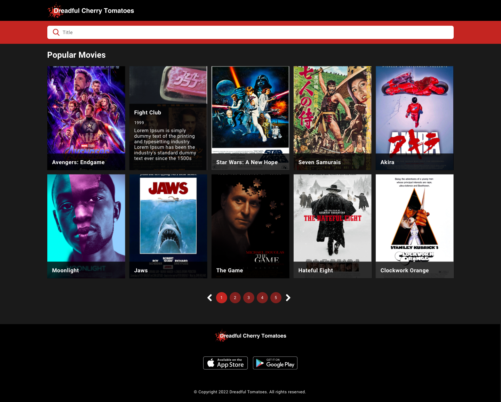

# Dreadful Cherry Tomatoes

Dreadful Cherry Tomatoes is a new platform to find movies. The main objective is to
help users to find information about their favourite movies.

To do so, the company has to create a new web app that allow users to do some fancy things.

## What do you have to do?

Dreadful Cherry Tomatoes needs to implement an awesome webpage where the users could view information
about almost every new movie.

The Design team has sent us the new interface which has to be implemented. To keep it simple, there is only one page: the movies page.

The movies page is the landing page of the webpage and shows a list of movies. In this page the user will see a list of cards with the title, year, description and image from each movie, sorted by the most recent. 10 cards per page, sorted by most recent release year. And the user could filter movies by title.

Here you could see the design of the movies pages:

## App

App component will be the one that wraps all the application. Here we will have the logic to fetch and filter the data.

The code of the application will be difided in 3 main parts:
- Header
- Home
- Footer

## Header

Header component will have the web logo and the input field that allows the user to filter movies.

Here I have used **MUI** react library, to take an input field already created, with some styles and with the option to have placeholders and icon at the start of the input field.

## Footer

Footer component will be a simple component, that will display:
- Web logo
- App Store and Google Play buttons.
- Copyright text info.

## Home

Home component will be the one that wil have "the logic" of the application.

We can split this component in two different simpler components:

- Card
- Pagination

### Card

Card component will be the one in charge to show the details of each movie. This component will show the movie poster, and the title, but will show more details when hovering the card.

To do this, the component was created with the following structure:
 - Background: A div that will have the poster movie.
    - Content: Div that wraps the content taht will be shown.
        - Title: Movie title
        - Hover Module: Inside this `div` we will have the content that will be shown when hovering the card.
            - Release year: Movie release year
            - Description: Movie description
            

So, to do that effect, I neede to use CSS in order to show and hide the details while hovering the card.

### Pagination

Finally pagination module. This component will also use Pagination component from **MUI** and this will allow us to show just the movies needed on each page.

